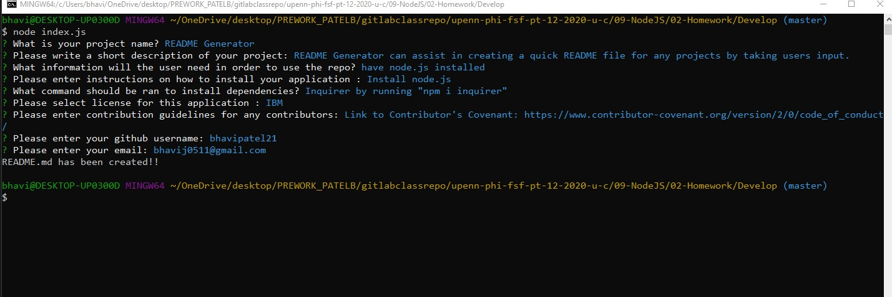

## Project Title
  README Generator
  
  ## Table of Contents

* [Description](#description)
* [Installation](#installation)
* [Usage](#usage)
* [Contribution Guidelines](#contribution-guidelines)
* [License](#license)
* [Questions](#questions)

## Description

README Generator can assist in creating a quick README file for any projects by taking users input.

## Installation Instructions
You will need node.js installed 
* [Node.js](https://en.wikipedia.org/wiki/Node.js)

To install the required dependencies, please run the following command:
* [inquirer](https://www.npmjs.com/package/inquirer/v/0.2.3)
```
npm i inquirer 

```

## Usage :

[Video]()

## Mock-up :



## Contribution Guidelines
Link to Contributor's Covenant: https://www.contributor-covenant.org/version/2/0/code_of_conduct/

## License


*This project uses the [IBM](https://spdx.org/licenses/IPL-1.0.html) license.*


## Questions
Github Profile : (https://github.com/bhavipatel21)
If you have any questions please email me at bhavij0511@gmail.com
  
  